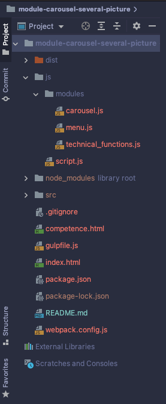

# module-carousel-several-picture
Модуль содержит скрипт, который создаст зацикленный слайдер-карусель с просмотром нескольких картинок в окне просмотра, с кнопками Вперёд / Назад и с кнопками-переходами на любой слайд.

<br />

## Дерево файлов и каталогов
Необходимо сформировать файловое дерево в соответствие с настройками ___Webpack___ и ___GulpJS___. Данные настройки находятся в одноименных файлах: ___webpack.config.js___ и ___gulpfile.js___, если таковые имеются в репозитории.

<br />



> Важно! В подключаемых файлах важно прописать правильные пути. Большинство ошибок это ошибки в путях.

<br />

## Подключение модуля
В данном репозитории точкой вхождения ___Webpack___ является _./js/script.js_.
<br /> Импортируем в него модуль со скриптом слайдера:
```javascript
// Точка вхождения Webpack: "./js/script.js'
"use strict";

import carousel from "./modules/carousel";

window.addEventListener('DOMContentLoaded', () => {
    carousel({
        carouselSelector: '.carousel',
        listSelector: '.carousel__list',
        itemsSelector: '.carousel__item',
        nextArrow: '#carouselBtnRight',
        prevArrow: '#carouselBtnLeft',
        markerWidth: '#markerForWidth',
        indicatorsSelector: 'ol',
    });
});
```
<br />

## Деструктуризация объекта с аргументами
Функция slider() принимает объект следующих аргументов {}:

| Ключ | Значение | Значение селектора | 
| :---- | :---- | :--- |
| carouselSelector | .carousel | Селектор является контейнером для всего слайдера, в который будем добавлять js-верстку |
| listSelector | .carousel__list | Все слайды |
| itemsSelector | .carousel__item | Каждый слайд |
| nextArrow | #carouselBtnRight | Стрелка управления ВПЕРЁД |
| prevArrow | #carouselBtnLeft | Стрелка управления НАЗАД |
| markerWidth | #markerForWidth | Ширина слайда |
| indicatorsSelector | .ol | Массив, в который пушится точки-управления |

